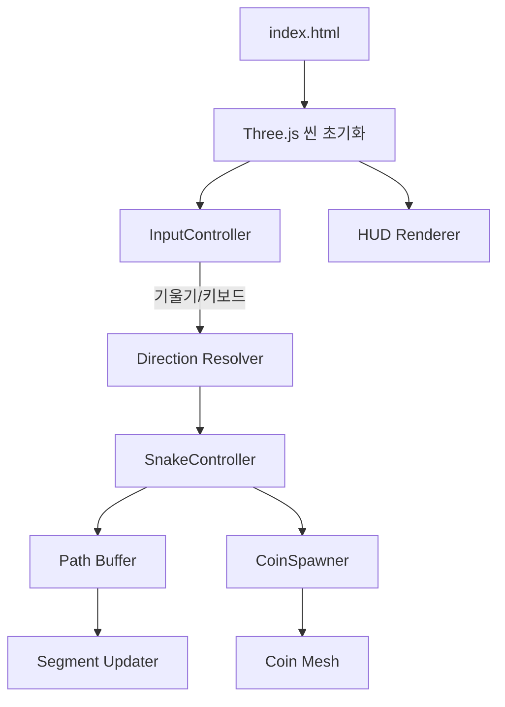

# Design Document

## 기술 스택 및 프레임워크
- **렌더링**: [Three.js](https://threejs.org/)을 사용해 아이소메트릭 3D 씬을 구성합니다.
- **자이로 입력**: 표준 `DeviceOrientationEvent`로 모바일 기울기 값을 수집하며, iOS 권한 요청 버튼을 제공합니다.
- **번들링**: 순수 ES 모듈 구조를 사용해 별도의 번들러 없이 배포합니다.
- **스타일링**: 반응형 레이아웃을 지원하기 위해 CSS Flexbox를 사용합니다.

## 아키텍처 개요

- **InputController**: DeviceOrientation과 키보드 이벤트를 통합해 표준화된 방향 요청을 생성합니다.
- **Direction Resolver**: 현재 이동 방향과 입력을 보간하여 최종 벡터를 계산합니다.
- **SnakeController**: 헤드 이동, 경로 버퍼 업데이트, 세그먼트 위치 계산 및 길이 증가를 담당합니다.
- **Path Buffer**: 헤드 이동 경로를 누적 저장하며, 총 길이를 기준으로 오래된 기록을 제거합니다.
- **CoinSpawner**: 5초 타이머 기반으로 빈 셀에 코인을 생성하고, 수집 로직을 담당합니다.
- **HUD Renderer**: 점수, 센서 상태, 안내 메시지를 표시합니다.

## 데이터 구조
- `gridSize`: 32 (셀 수)
- `tileSize`: 1 (각 셀 길이)
- `snakeSegments`: `THREE.Mesh[]`
- `pathPositions`: `THREE.Vector3[]` (헤드 경로)
- `pathDistances`: `number[]` (각 경로 지점까지의 누적 거리)
- `coin`: { mesh: THREE.Mesh, cell: { x, y }, active: boolean }

## 렌더링 구성
- **카메라**: OrthographicCamera로 `45°` X, `45°` Y 회전된 아이소메트릭 구도.
- **조명**: AmbientLight + DirectionalLight로 간단한 그림자 느낌을 부여합니다.
- **지면**: 32x32 평면에 GridHelper 또는 커스텀 타일 메시를 사용합니다.
- **프레임 루프**: `requestAnimationFrame` 기반으로 매 프레임 이동 및 렌더링을 수행합니다.

## 상호작용 흐름
1. 페이지 로드 후 `initScene()`에서 씬, 카메라, 조명, 격자, HUD를 구성합니다.
2. `initInput()`에서 센서 권한 버튼 및 키보드 이벤트를 설정합니다.
3. `startGame()`이 호출되면 캐릭터와 경로 버퍼를 초기화하고 코인 생성 타이머를 시작합니다.
4. `animate()` 루프에서:
   - 입력 데이터를 기반으로 `currentDirection`을 보간.
   - `moveSnake(deltaTime)`으로 헤드 위치 갱신 및 경로 버퍼 업데이트.
   - `updateSegments()`로 세그먼트 위치 재계산.
   - `checkCoinCollision()`으로 코인 수집 여부 확인.
   - `spawnCoinIfNeeded()`로 타이밍 체크.
   - `renderer.render(scene, camera)` 수행.
5. HUD는 점수와 센서 상태를 `requestAnimationFrame` 루프에서 업데이트합니다.

## 오류 및 예외 처리
- DeviceOrientation 미지원 시 HUD에 경고 메시지 노출 및 키보드 조작 안내.
- 센서 권한 거부 시 버튼을 다시 노출하고, 입력 상태를 강제로 키보드 모드로 전환.
- 코인 생성 시 무한 루프 방지를 위해 최대 시도 횟수를 설정합니다.

## 성능 고려 사항
- 세그먼트 수가 증가해도 성능을 유지하기 위해 경로 버퍼 길이를 최소한으로 유지.
- 렌더링 최적화를 위해 재질 재사용, 그림자 미사용, 텍스처 대신 단색 재질 사용.
- 모바일에서 고주사율을 제한하기 위해 `deltaTime` 기반 속도 제어.

## 테스트 전략
- **장치 테스트**: 안드로이드 Chrome, iOS Safari에서 기울기 응답 확인.
- **데스크톱 테스트**: Chrome/Firefox에서 키보드 조작, 반응형 레이아웃 확인.
- **유닛 수준**: Path buffer, coin spawn 함수에 대한 단위 테스트는 브라우저 콘솔에서 수행 가능한 헬퍼 함수로 작성.

