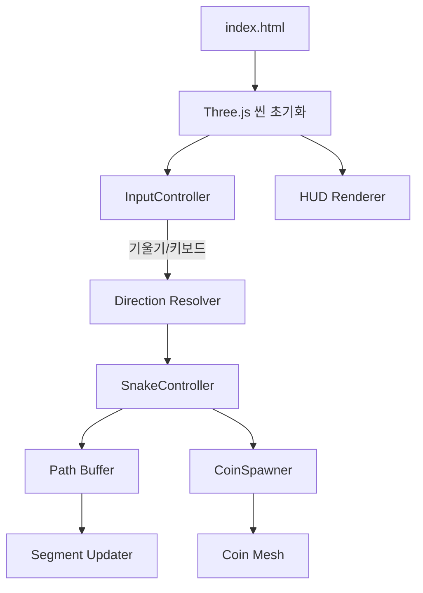

# Design Document

## 기술 스택 및 프레임워크
- **렌더링**: [Three.js](https://threejs.org/)을 사용해 아이소메트릭 3D 씬을 구성합니다.
- **자이로 입력**: 표준 `DeviceOrientationEvent`로 모바일 기울기 값을 수집하며, iOS 권한 요청 버튼을 제공합니다.
- **번들링**: 순수 ES 모듈 구조를 사용해 별도의 번들러 없이 배포합니다.
- **스타일링**: 반응형 레이아웃을 지원하기 위해 CSS Flexbox를 사용합니다.

## 아키텍처 개요

- **InputController**: DeviceOrientation과 키보드 이벤트를 통합해 표준화된 방향 요청을 생성하며, 카메라 기준 우/하 벡터로 기울기를 지면(XZ) 평면에 투영해 화면에서 더 낮은 방향과 이동 방향이 일치하도록 정규화합니다. 키보드 입력은 좌우 화살표(왼쪽=시계, 오른쪽=반시계)만 사용합니다.
- **Direction Resolver**: 현재 이동 방향과 입력을 보간하여 최종 벡터를 계산하며, 경계면에 닿았을 때는 유효한 평행 성분만 남겨 벽면을 따라 미끄러지도록 투영하고 좌/우 화살표 입력 시 진행 방향을 상대적으로 회전시킵니다.
- **SnakeController**: 헤드 이동, 경로 버퍼 업데이트, 세그먼트 위치 계산 및 길이 증가를 담당합니다.
- **Path Buffer**: 헤드 이동 경로를 누적 저장하며, 총 길이를 기준으로 오래된 기록을 제거합니다.
- **CoinSpawner**: 5초 타이머 기반으로 빈 셀에 코인을 생성하고, 수집 로직을 담당하며 코인 메시와 글로우 스프라이트를 함께 제어합니다.
- **HUD Renderer**: 점수, 센서 상태, 안내 메시지를 표시하고, 본게임 전 인트로 오버레이(조작법 안내 + 시작 버튼)를 노출한 뒤 게임이 시작되면 숨깁니다.
- **GameState Controller**: 자기 충돌 시(단, 바로 뒤 세그먼트와의 겹침은 허용) 게임 오버 상태를 설정하고, 재시작 오버레이 표시를 제어합니다.

## 데이터 구조
- `gridSize`: 16 (셀 수)
- `tileSize`: 1 (각 셀 길이)
- `snakeSpeed`: 4 (타일/초 기준 이동 속도)
- `snakeSegments`: `THREE.Mesh[]`
- `pathPositions`: `THREE.Vector3[]` (헤드 경로)
- `pathDistances`: `number[]` (각 경로 지점까지의 누적 거리)
- `coin`: { mesh: THREE.Mesh, glow: THREE.Sprite, cell: { x, y }, active: boolean }

## 렌더링 구성
- **카메라**: OrthographicCamera로 `45°` X, `45°` Y 회전된 아이소메트릭 구도.
- **조명**: AmbientLight + DirectionalLight로 간단한 그림자 느낌을 부여합니다.
- **지면**: 16x16 평면에 배경보다 밝은 #12EF76/#4FF2C1 타일을 번갈아 적용해 체커 패턴을 만들고, 대비를 높여 캐릭터/코인이 또렷하게 보이게 한다.
- **스네이크 재질**: 헤드는 #F23D9B, 몸통은 #30E5FF/#0181FD 팔레트를 교차로 사용해 세그먼트 위치를 쉽게 식별한다.
- **코인 재질**: 황금색 실린더 메시와 Additive 블렌딩 스프라이트를 겹쳐 연한 글로우를 주고, 프레임마다 크기를 살짝 변조해 맥동한다.
- **레이아웃**: CSS `aspect-ratio` + `clamp` 조합으로 캔버스 높이를 뷰포트에 맞춰 제한해 어떤 해상도에서도 보드가 화면 밖으로 잘리지 않는다.
- **프레임 루프**: `requestAnimationFrame` 기반으로 매 프레임 이동 및 렌더링을 수행합니다.

## 상호작용 흐름
1. 페이지 로드 후 `initScene()`에서 씬, 카메라, 조명, 격자, HUD를 구성합니다.
2. `initInput()`에서 센서 권한 버튼 및 키보드 이벤트를 설정하고, 조작법을 담은 인트로 오버레이를 표시합니다.
3. 사용자가 인트로 오버레이의 "게임 시작" 버튼을 누르면 `startGame()`을 호출하여 캐릭터/경로 버퍼를 초기화하고 코인 생성 타이머를 시작합니다.
4. `animate()` 루프에서:
   - 입력 데이터를 기반으로 `currentDirection`을 보간하고, 키보드 입력 시 일정 각속도로 좌/우 회전.
   - `moveSnake(deltaTime)`으로 헤드 위치 갱신 및 경로 버퍼 업데이트.
   - `updateSegments()`로 세그먼트 위치 재계산.
   - `checkSelfCollision()`으로 자기 충돌 여부를 검사하고, 필요 시 게임오버 처리.
   - `checkCoinCollision()`으로 코인 수집 여부 확인.
   - `spawnCoinIfNeeded()`로 타이밍 체크.
   - `renderer.render(scene, camera)` 수행.
5. HUD는 점수와 센서 상태를 `requestAnimationFrame` 루프에서 업데이트합니다.

## 오류 및 예외 처리
- DeviceOrientation 미지원 시 HUD에 경고 메시지 노출 및 키보드 조작 안내.
- 센서 권한 거부 시 버튼을 다시 노출하고, 입력 상태를 강제로 키보드 모드로 전환.
- 코인 생성 시 무한 루프 방지를 위해 최대 시도 횟수를 설정합니다.

## 성능 고려 사항
- 세그먼트 수가 증가해도 성능을 유지하기 위해 경로 버퍼 길이를 최소한으로 유지.
- 렌더링 최적화를 위해 재질 재사용, 그림자 미사용, 텍스처 대신 단색 재질 사용.
- 모바일에서 고주사율을 제한하기 위해 `deltaTime` 기반 속도 제어.

## 테스트 전략
- **장치 테스트**: 안드로이드 Chrome, iOS Safari에서 기울기 응답 확인.
- **데스크톱 테스트**: Chrome/Firefox에서 키보드 조작, 반응형 레이아웃 확인.
- **유닛 수준**: Path buffer, coin spawn 함수에 대한 단위 테스트는 브라우저 콘솔에서 수행 가능한 헬퍼 함수로 작성.

